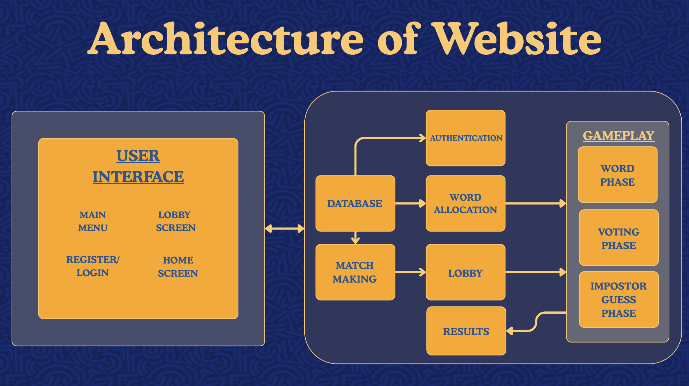
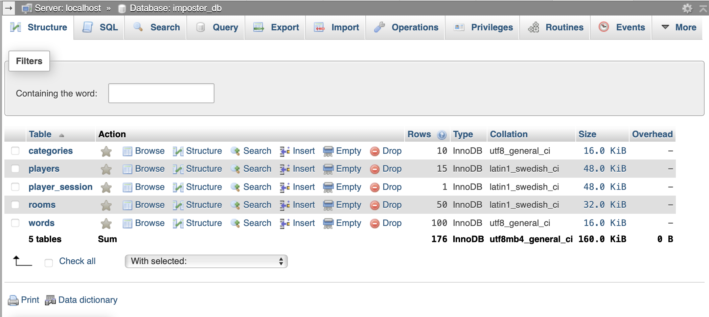

#  IMPOSTER — 1st Year Computer Science Team Project

Welcome to the official repository for our 1st Year Computer Science Group Project! This project is a real-time, web-based multiplayer social deduction game designed to offer an engaging, secure, and seamless experience for players.

---

## 📸 Preview & Demo


---

## 📌 Key Features & Highlights

* **Real-Time Colour-Coded Chat:** Live player communication during game rounds featuring dynamic colour coding for enhanced readability.
* **Intuitive Design & Audio:** Custom-crafted graphics and custom background music designed to deliver an engaging user experience.
* **SQL Injection Protection:** Enhanced backend security utilizing parameterized queries to keep data safe against common database vulnerabilities.
* **Automated Data Privacy & Cleanup:** The MySQL database automatically clears round and match data after each game to maintain security and privacy.
* **Ethical & Safe Environment:**
  * Automated profanity filter in chat.
  * Age-appropriate design suitable for all players.
  * Transparent game rules ensuring fair play.
  * Zero unnecessary personal data collection.

---

## 🏗️ System Architecture

The project utilizes a hybrid architecture built on **PHP** for core user authentication, **Node.js + WebSockets** for real-time multiplayer communications, and **MySQL** for structured data persistence.



### Core Game Workflow

1. **Authentication:** User registration and secure login managed via PHP and MySQL.
2. **Matchmaking & Lobby:** Hosted and joined lobbies powered by Node.js WebSocket server channels.
3. **Word Allocation:** Dynamic secret word and role assignment (e.g., standard player vs. impostor) pulled from MySQL.
4. **Gameplay Phases:**
   * **Word Phase:** Players share clues and discuss their assigned words.
   * **Voting Phase:** Players vote in real time to uncover the impostor.
   * **Impostor Guess Phase:** The accused player gets a final chance to guess the secret word.
   * **Results:** Win/loss conditions are calculated and displayed to the lobby.

---

## 🗺️ Website Navigation Chart

The navigation diagram below illustrates the complete player journey through registration, lobby management, and the core gameplay loop.


---

## 🗄️ Database Structure

The relational database in **MySQL** manages user accounts, room instances, word pools, and temporary match states.



---

## 🛠️ Tech Stack

* **Frontend:** HTML5, CSS3, JavaScript (ES6+)
* **Visuals & Audio:** Custom-made artwork, custom soundtrack, and styled UI elements
* **Real-Time Communication:** Node.js, WebSockets (`ws`)
* **Backend:** PHP
* **Database:** MySQL

---

## ⚙️ Getting Started

### Prerequisites

* [Node.js](https://nodejs.org/) (v14+ recommended)
* PHP (v7.4+ or v8.x)
* MySQL Server (e.g., XAMPP, WAMP, or standalone MySQL)


## 🛡️ Ethical & Safety Considerations

* **Privacy:** No personal user tracking or unnecessary data collection.
* **Safety:** Integrated profanity filter for clean chat interactions across all ages.
* **Data Cleanup:** Post-game database cleanup ensures transient game data is deleted immediately after each round.

___

### Installation & Setup

1. **Clone the Repository**

2. **Database Setup**
   * Import the database schema (`.sql`) into your MySQL database server.
   * Configure your database credentials (`host`, `username`, `password`, `dbname`) in your PHP backend config file.

3. **Start the WebSocket Server**
   ```bash
   cd websocket-server
   npm install
   node server.js
   ```

4. **Launch Web Server**
   * Serve the project directory via an Apache/Nginx local server (e.g., XAMPP `htdocs`).
   * Navigate to `http://localhost/your-repo-name/index.php` in your browser.


---

## 👥 Contributors

Alisa Krasnopolska: lead, full stack
Artem Miezientsev: backend, database
Razin Ikmal Bin Annis: frontend
Sama Sweed: backend
Shiven Singh: hosting